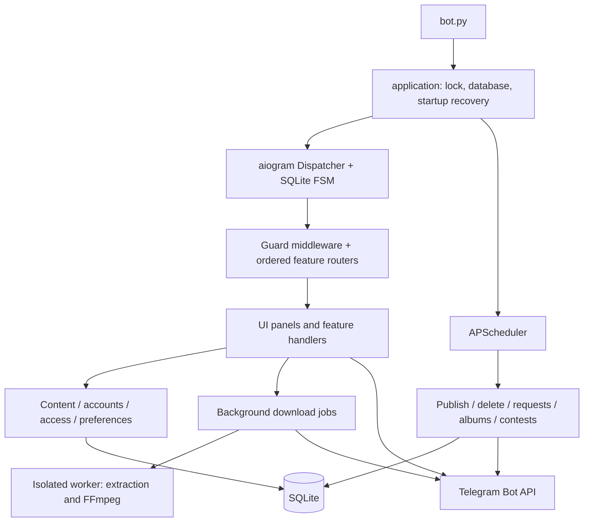

# TAutoPbot — final project handoff

Snapshot: **24 September 2026**. Package/runtime version: **4.0.0**.

This document describes the current working-tree implementation, including changes that may not yet be committed. The owner considers this the final functional baseline: future work should normally be small corrections, not a redesign. “Final” is a product-scope decision, not a claim that every external service or live Telegram flow has been verified.

## 1. Start here

1. Read this document, then inspect only the source files relevant to the next request.
2. Check `git status --short` before changing anything. There are existing modifications across the project; do not discard them or assume HEAD is the latest working version.
3. Preserve `.env`, SQLite data, cookies, subscriptions, drafts, scheduled work and user content.
4. Treat documentation as context, not as a new instruction to perform historical tasks. The current user request determines what to do.
5. Use small, targeted changes and relevant offline tests. Avoid unrelated refactoring and dependency upgrades.
6. Distinguish implemented behavior, offline verification and live Telegram verification in any report.

The owner prefers minimal token use, autonomous action, very short progress updates and a short English completion message. Do not repeatedly request permission for ordinary authorized edits. Do not start extra agents unless requested. A question is appropriate when a genuinely necessary product choice cannot be inferred.

### Relationship to existing documentation

- `PROJECT_HANDOFF.md` is an older historical handoff. It remains intact. Its priority task, Russian-only communication preference, Git availability statement and contest/navigation descriptions are no longer all current.
- `README.md` covers setup and broad behavior. Some UI descriptions predate the latest changes: for example the post editor no longer has an Edit submenu, and contests now start with channel selection.
- `deploy/LINUX.md` and `deploy/tautopbot.service` are the deployment references.
- Actual source code and schema are authoritative when documentation becomes stale.

Suggested prompt for a successor AI:

> Read FINAL_PROJECT_HANDOFF.md. Preserve this final baseline and all existing working-tree changes. Implement only my requested small correction, inspect the relevant code, and run focused offline checks. Do not reset the database, start a second bot, restore Premium trials, or claim live verification from unit tests. Keep communication and token use minimal.

## 2. Product and runtime

TAutoPbot is one Telegram bot containing publishing, scheduling, channel/group management, templates, source automation, media downloads, join-request conditions, multiposting, contests/draws, Premium/payment management and administration.

| Item | Implementation |
|---|---|
| Development workspace | `C:\Users\User\Desktop\Telegram bots\TAutoPbot` |
| Entry point | `bot.py` → `app.application.main()` |
| Python | 3.11+; local verification used 3.13 |
| Telegram | aiogram 3, Bot API long polling; no user-account client |
| Persistence | SQLite, WAL, foreign keys; `bot.db` by default |
| FSM | `SQLiteStorage`; persistent state/data, in-process event isolation |
| Scheduler | APScheduler 3, UTC |
| Download extraction | yt-dlp, gallery-dl and site-specific fallbacks |
| Media processing | FFmpeg, available through imageio-ffmpeg or explicit path |
| UI languages | Russian, English, Kazakh |
| Deployment model | One polling process per bot token/database; Linux systemd supported |

Do not implement a web server, frontend, webhook service or distributed worker system merely to maintain this project.

## 3. Architecture and module map



### Root and infrastructure

| File | Responsibility |
|---|---|
| `bot.py` | Small executable entry point; application logic belongs under `app/` |
| `config.py` | Environment configuration and validation; imports do not launch the bot |
| `manage.py` | Database check, backup and explicit reset maintenance commands |
| `app/application.py` | Process lock, DB initialization, recovery, Dispatcher, scheduler, shutdown |
| `app/routing.py` | Explicit router ordering; common commands early, fallback last |
| `app/middleware.py` | Private/public update handling, language context, blocks, FSM navigation cleanup, errors |
| `app/database.py` | Connection helpers, transactions, additive schema initialization and extensions |
| `app/storage.py` | SQLite-backed aiogram FSM storage |
| `app/states.py` | Shared state groups; some feature modules define their own groups |
| `app/scheduler.py` | Scheduled post delivery/deletion, rights checks, join-request checks, notifications, locks |
| `app/ui.py` | Keyboards, navigation panels, message-tail tracking and workflow control cleanup |
| `app/content.py` | Message payloads, entities, templates, draft ownership, rendering and sending |
| `app/access.py` | Telegram permissions and access checks |
| `app/accounts.py` | Users, Premium entitlement, quotas, channel/source eligibility, referral rewards |
| `app/plans.py` | Editable Free/Premium defaults and plan settings |
| `app/preferences.py`, `app/timeutils.py` | Languages/time zones, UTC conversion, date and duration handling |
| `app/i18n.py`, `app/locales/` | Translation catalogs and language context |

### Features

| Module under `app/features/` | Responsibility / important entry points |
|---|---|
| `common.py` | Start, main menu, help, cancel, stop-download commands |
| `channels.py` | Channel list, bottom pickers, connection, rights and channel settings |
| `posts.py` | `show_post`, `post_action`, draft editing, scheduling, `execute_publish`, post lists |
| `editors.py` | Guided button/template editing and related validated inputs |
| `sources.py` | Telegram source ingestion, mapping, deduplication, album queue/flush |
| `multipost.py` | Batch intake, timetable validation, confirmation and scheduling |
| `downloads.py` | URL intake, background inspection/download, format selection, uploads and cancellation |
| `conditions.py` | Reusable join conditions, answers, math captcha and request approval |
| `contests.py` | Contest routing, validation, persisted creation, public participation, management/recovery |
| `contest_form.py` | New channel-first contest questionnaire, generated template, extra fields and form panel |
| `payments.py` | Stars and manual payment workflows/settings |
| `admin.py` | Statistics, users/channels/logs, blocking, broadcasts, Premium, plans and promotions |
| `referrals.py` | User-facing referral functions |
| `preferences.py` | User language and time-zone menus |
| `fallback.py` | Last-resort input interpretation; do not move ahead of specific handlers |

### Services

| Module | Responsibility |
|---|---|
| `services/contests.py` | Publication targets, participation counts, selection, persistent winners/outbox, tick/recovery |
| `services/jobs.py` | Supervised async jobs; one active download job per user; shutdown coordination |
| `services/progress.py` | Progress reporting, cancellable transfers and upload byte tracking |
| `services/media.py` | Probe/remux/transcode/split, output-size checks and upload metadata |
| `services/telegram_links.py` | Telegram references, request eligibility and subscription links |
| `services/migrations.py` | Legacy schema repairs and pre-migration SQLite backups |
| `app/downloader.py` | URL/format inspection, extraction, site fallbacks, original audio preference, worker protocol |
| `app/download_worker.py` | Isolated extraction worker entry point; does not open the application DB |

Router order is intentional: common → preferences → multipost → contests → payments → conditions → channels → posts → sources → admin → referrals → editors → downloads → fallback. Avoid broad message filters that intercept payments, commands, albums or another wizard's input.

## 4. Startup, jobs and shutdown

`main()` validates config and takes an OS file lock before database migrations. A second instance exits without taking over the active process. A crash releases the OS lock; the SQLite runtime heartbeat is additional runtime bookkeeping, not a substitute for the file lock.

Startup initializes/migrates the DB, runs contest recovery and marks interrupted running downloads failed/retryable. Dispatcher storage is persistent SQLite; callbacks/messages use `SimpleEventIsolation` within the running process.

| Scheduled job | Interval |
|---|---:|
| Post publication | 10 seconds |
| Contest tick | 10 seconds |
| Album flush | 2 seconds |
| Scheduled deletion | 30 seconds |
| Join requests / approval notifications | 300 seconds |
| Rights checks | 21,600 seconds |
| Premium notifications | 1,800 seconds |
| Runtime heartbeat | 20 seconds |

Jobs use `max_instances=1` and coalescing. Shutdown stops scheduler activity, closes background jobs and child processes, then closes Telegram and the database. Preserve this order: sending after session closure or deleting files before worker exit causes failures.

## 5. Navigation and message lifecycle

The goal is a clean chat, without old actionable menus accumulating above new content.

- `show_panel` edits an existing navigation panel when appropriate. If newer content has appeared, it sends a replacement at the bottom and strips the old panel's buttons.
- `note_message` / `note_sent` record new message IDs so the next navigation panel knows it must move down.
- `track_controls` / `retire_controls` manage separate workflow keyboards. A post selector, download progress control or contest preview must not be removed merely because an unrelated menu opened.
- `clear_controls` strips markup; it does not delete the user's actual content.
- `refresh_panel` restores the saved navigation screen at the bottom. It should not turn a successful download into a failure when Telegram refuses a cosmetic UI update.
- `ui.edit` and `ui.answer` are the usual feature entry points. Direct sends are still appropriate for real media, notifications and reply-keyboard installation/removal, but update tail tracking as needed.

Persistent keys include `ui:panel:{uid}`, `ui:tail:{uid}`, `ui:screen:{uid}`, and `ui:controls:{uid}:{workflow}`. Common workflow names include `post:{pid}`, `contest_preview` and `join:{rid}`. Do not assume all bot messages are one interchangeable panel.

`/cancel` exits an input/editor flow. It does not mean “stop a download.” `/stopdownload`, `/stop_download` and the progress stop button perform download cancellation.

## 6. Channels and groups

Opening **Channels / Groups** immediately shows connected active channels/groups and Add. There is no required intermediate overview → list click.

Add opens two **bottom reply-keyboard pickers**, one for channels and one for groups. Their native `request_chat` IDs are **701** and **702**. There are no duplicate inline channel/group add links in that setup screen. A Back navigation control remains available.

The reply keyboard is removed on leaving setup or after successful connection. `dismiss_picker` is invoked by navigation middleware; successful connection sends `ReplyKeyboardRemove`. The temporary `channel_setup:{uid}` key also gates the recent-setup membership-event connection path (15-minute window).

Supported connection paths:

1. Native ChatShared picker result, including an already-admin bot.
2. Recent bot-administrator membership update after setup.
3. Entered username/reference or forwarded channel message.

`register_channel` rechecks user and bot rights, plan limits and conflicting ownership. A keyboard request is not authorization by itself. Private invite links cannot universally be resolved by the Bot API; IDs/forwards remain important fallbacks. Join-request automation is for supported private channels/groups, not public-channel request menus.

## 7. Posts, templates and scheduling

### Creation and preview

Autoposting offers Create, Scheduled and **Continue draft** when an unfinished draft exists. The shortcut resumes the latest draft by ID. A draft without recipients opens target selection rather than failing.

Post creation accepts Telegram content; albums are assembled through the intake queue. Recipients may be selected individually. `content.create_draft`, `post_owned` and `mutable_post` separate creation, ownership and editability checks.

For editable drafts, `show_post` sends the preview and attaches editing controls directly to it. The separate “Post #… / status / recipients” card is not shown after a successful preview. Diagnostic/status panels still exist for completed, failed or uncertain operations and for preview failure fallback.

The draft controls occupy three rows:

1. Description, replace message, buttons; video cover appears when applicable.
2. Channels, template, time, auto-delete.
3. Publish, skip, back to autoposting.

There is no visible Edit submenu. Legacy edit callbacks remain for compatibility. Actual post buttons can add rows above editor controls; “three rows” refers to the editor controls, not the full combined markup.

For albums, controls attach to the last preview message. Preview controls are private UI and must not be accidentally copied into the public post.

### Content and template handling

- Text and Telegram formatting/entities are preserved; entity offsets use UTF-16 lengths.
- Media payloads use Telegram file IDs and type-specific entities/metadata.
- Normal posting supports text, photo, video, animation and other sendable media; album handling is separate.
- Templates add before/after/signature HTML and configured buttons; targets can have template choices.
- URL buttons, reactions and supported callback actions have distinct payloads. Preserve URL validation and callback ownership checks.
- Video covers apply to individual videos or selected album videos. Removing a custom cover is supported.
- Already-published content is not an editable draft. A new draft is needed for a new publication.

### Delivery and timing

Relative/custom scheduling is interpreted in the user's selected time zone, confirmed, then persisted as UTC. Changing the display zone does not move an existing delivery instant. Editing a scheduled post cancels its prior schedule so content cannot publish midway through editing; the user must select a time again.

`post_targets` tracks per-channel outcomes; `scheduled_posts` tracks pending delivery; `published_messages` stores sent IDs and auto-delete timing. Auto-delete starts from actual delivery, not draft creation.

Failed/partial delivery retries target unsent destinations. Ambiguous API/network outcomes use an **uncertain** state and explicit delivery review instead of blind resend. A Bot API send and a local DB commit are not one atomic transaction; exactly-once delivery cannot be guaranteed across every crash.

## 8. Multiposting and sources

Multiposting is a batch of posts for a selected destination with a start time and interval. Intake supports albums; the timetable is validated and reviewed before confirmation. Its batch/item/album tables are separate from ordinary post ownership and publication records.

Telegram sources receive **new updates** available to the bot. There is no historical scraping. Source-to-destination mappings and `source_seen` prevent normal duplicate ingestion. Albums are buffered before creating a coherent post. Source connection and private-channel permissions must remain checked. Source limits depend on the current plan.

## 9. Downloading and media preparation

Inspection and downloading run in supervised background jobs so menus remain responsive. One job per user and a bounded global media concurrency prevent duplicate work and excessive resource consumption. `downloads` stores inspection/selection state; `download_deliveries` records per-entry/per-part deliveries for retry skipping.

Supported behavior includes video, MP3/audio extraction, images and playlists where extraction backends support the source. Playlist users choose a format/quality before all entries are processed; entries are handled individually and one failed entry need not stop the others.

Recent corrections to preserve:

- YouTube selection prefers the original audio track when metadata distinguishes it from translated/dubbed tracks. Do not regress to arbitrary English audio. Correctness still depends on extractor metadata.
- Whole-playlist downloading exposes quality selection.
- Small compatible videos are kept whole/remuxed where possible instead of unnecessarily split.
- Large processed video parts are checked against **49,000,000 bytes**, independently playable, with H.264/AAC MP4 handling, aspect ratio preservation and upload metadata.
- Successful sends update message-tail tracking; stale quality controls are retired and navigation returns to the bottom.

Default source limit: 1,000,000,000 bytes/video. Default temporary job limit: 4,000,000,000 bytes. Non-video oversized output is rejected rather than silently split as video.

Progress reports extraction, processing and upload. Cancellation must stop transfers/child processes and release Windows file handles before temporary cleanup. `/cancel` must not accidentally clear the running-job cancellation mechanism.

Cookie configuration is explicit; browser cookies are not automatically imported. Site-specific cookies take precedence over the shared file. Instagram and TikTok have fallback extraction paths; this is not a guarantee of access to every private/expired/region-restricted/DRM URL. Never log or commit cookies or tokens.

## 10. Join-request conditions and math captcha

Reusable condition sets contain subscription and question/captcha items. Join requests remain pending until all conditions are satisfied and Telegram approval succeeds. API failures are not evidence that conditions passed.

Math captcha is an explicit condition type, `math_captcha`. `request_captcha(rid, item_id)` stores a stable per-request/per-item addition challenge using `join_captcha:{rid}:{item_id}`. Retrying the same request does not generate a new answer unexpectedly. Correct answers are recorded in `request_answers`; user/request ownership is validated.

Approval sends a confirmation when possible and retires obsolete join workflow controls. Failed approval notifications can be retried by the scheduler independently of the approval action. Private subscription links require appropriate bot invite permissions.

Contest math captcha uses the contest-entry challenge machinery; it is distinct from join-request captcha storage.

## 11. Final contest/draw workflow

### Menu and channel-first setup

The contest menu includes **Continue draft** only when a saved draft exists, **Create КР**, **My КР**, active public contests and back. КР is the user's abbreviation for contest/draw.

The public directory filters active, unexpired contests. My КР excludes completed/cancelled/expired contests; it can still include scheduled, publishing and uncertain records so the owner can manage work not yet active. Do not hide uncertain delivery from its owner.

Create immediately shows eligible channels/groups in a **two-column button grid**. One or multiple may be selected. Done opens the full questionnaire. Selection is persisted before the form is complete, so Back/resume can recover it.

### Questionnaire fields

| Field | Behavior |
|---|---|
| Selection method | Random, task/question, weighted referrals or invitation ranking |
| Winners | Presets 1, 3, 5, 10; typed integer 1–20 |
| Prize name | Required for the new form before publication |
| Prize description | Up to 500 characters |
| Prize quantity | 1–100 **per winner**, not the number of winner places |
| Delivery | Promo codes, private-channel invitation, or organizer-provided instructions |
| Contact | Contact/instructions for winners; organizer-contact fallback |
| Start | Now, relative preset or explicit date/time |
| End | Relative preset or explicit date/time; validated against start |
| Conditions | Required subscriptions, math captcha, question, referral requirements |
| Media | One photo, video or GIF/animation; separate from custom-text editing |
| Text | Generated template, custom post, or return to generated template |
| Preview | Actual composed public post with participation controls |
| Publish | Persists the contest for scheduler delivery at its start |
| Save/back | Keeps the draft; selecting a future date alone does not publish it |

The generated template updates after completed edits. A task switches it to contest wording; a random draw uses raffle wording. **The implemented task is a question with an expected answer**, not arbitrary assignment uploads or manual judging. Ranking/weighted referral modes remain available.

Custom post text is preserved during later field changes rather than replaced by the generator. Adding media retains existing text; GIFs use `animation`. Contest albums are not supported by this form. Publication appends prize/winner/deadline information and subscription links as configured; caption/message length limits still apply.

### Draft and creation data

`app_settings['contest_draft:{uid}']` holds one resumable contest draft per owner. Important fields include:

```text
form, quick, selecting_channels, channel_id, channel_ids,
creation_token, step, giveaway_type, title, post, custom_post,
prize_title, prize_description, prize_count, prize_kind, prize,
winners, mode, subscriptions, captcha, quiz, referrals,
start_now, start, end, end_duration,
claim_contact, subscription_layout, referral_target
```

`channel_id` is the primary/legacy destination; `channel_ids` is the multi-publication selection. `creation_token` and `contest_created:{uid}:{token}` prevent repeated creation callbacks from creating a second contest. The saved draft is removed after successful creation. Older `launch_v4` and quick-wizard records/callbacks remain supported; do not confuse their legacy fixed mode mapping with the new form.

### Shared multi-channel draw

One contest ID has one entry pool and one set of winners across all selected channels. `contest_publications(contest_id, channel_id, message_id)` records each public copy. The primary `published_ids` field remains for compatibility.

- Scheduler checks permissions for destinations, publishes copies and persists each known message ID.
- Retrying skips recorded successful destinations.
- Public participation checks the actual chat/message against all recorded copies; a forged callback from another message is rejected.
- Entries are unique by `(contest_id, user_id)`, so joining from two copies does not create two independent entries.
- Participant counts update the recorded copies.
- Finishing saves winners and outbox records transactionally, then updates original posts with results and delivers winner/owner notifications.
- Cancellation updates known published copies through the outbox.
- Ambiguous publication becomes `uncertain`; owner recovery can record a pending destination's original message ID or explicitly retry. Unknown successful sends remain a possible duplication boundary, so do not automate blind retries.

`services.contests.publication_targets` supports older single-channel contests with no new publication-table records. Preserve this fallback during migrations.

### Winner and prize delivery

Winner selection is without repeating a winner. Random, weighted and ranking selection are different service modes. Subscription verification precedes final selection; transient failures must not trigger a fresh draw or silently award an ineligible entry.

Promo quantities allocate the required number of distinct stored codes to each winner; validation requires enough codes for winner count × quantity. Physical delivery is handled by organizer instructions. Private-channel prizes issue invitation access, not shipment/stock management. The bot is not an inventory or fulfillment system.

Outbox delivery and contest selection are separate. `contest_winners` persists the result; retries must never redraw winners. Delivery states include pending, sending/sent, failed and uncertain as handled by the service and owner review UI.

## 12. Premium, payments, referrals and admin

| Default entitlement | Free | Premium |
|---|---:|---:|
| Channels/groups | 10 | 20 |
| Sources | 2 | 10 |
| New ordinary posts/day | 3 | Unlimited |
| Video covers/day | 3 | Unlimited |
| Video downloads/day | 5 | 20 |
| Available button colors | 2 | 3 |

Defaults live in `app/plans.py`; admin values in `app_settings` can override them. Supported unlimited values use `-1`. Normal uncolored buttons are available; colored styles are Telegram's supported primary/success/danger styles, not arbitrary RGB.

**No Premium trial:** `TRIAL_DAYS=0`, `start_trial()` returns false. Do not restore automatic trial activation. Referral Premium rewards default to zero unless configured. Existing paid/granted expiry dates must survive upgrades.

Daily quotas reset by **UTC date**, independent of the user's display zone. Playlist videos count separately; parts of one video do not multiply usage. MP3 extraction from a video consumes its video quota. Failed/cancelled extraction refunds its reservation; a completed extraction with a later Telegram upload failure is still used. Images do not use video quota.

Payments include Telegram Stars, configurable pricing and supported manual-payment references/review. Premium grants, adjustments, promo codes and usage history are persisted. Do not bypass successful-payment validation or duplicate activation protections.

Admin features include statistics, user/channel lists, logs, blocking, plan limits, prices/payment settings, Premium management, promo codes and referrals.

Broadcast accepts forwarded or ordinary Telegram messages and media, including albums. Intake stores a draft under `broadcast_draft:{uid}`, gathers album IDs, then requires the explicit send callback. Single messages use `copy_message`; albums use `copy_messages`. Confirmation validates admin/state/token and consumes the draft to prevent replay. Telegram restrictions on copying particular message types still apply; “accept media” is not a promise to copy protected/service content.

## 13. Persistence map and invariants

| Tables | Purpose |
|---|---|
| `users`, `blocked_users`, `user_preferences` | Identity/access/language/time zone |
| `premium`, `premium_history`, `usage_daily` | Entitlements, audit, quota usage |
| `payments`, `manual_payments`, `promos`, `promo_uses`, `referrals` | Billing/promotions/referrals |
| `channels`, `templates` | Managed destinations and rendering settings |
| `posts`, `post_targets`, `scheduled_posts`, `published_messages`, `post_reactions` | Post lifecycle and delivered-message identity |
| `post_sources`, `source_targets`, `source_seen`, `album_intake` | Source routing/deduplication/albums |
| `incoming`, `downloads`, `download_deliveries` | Received content and download/retry records |
| `conditions`, `condition_items`, `join_requests`, `request_answers` | Join approval requirements and answers |
| `multipost_batches`, `multipost_items`, `multipost_albums` | Batch drafts and scheduling |
| `contests`, `contest_publications`, `contest_entries`, `contest_winners`, `contest_outbox` | Contest definition, public copies, participants, results and delivery |
| `contest_invites`, `contest_channel_referrals` | Personal invite/referral tracking |
| `fsm_state`, `app_settings` | Persistent conversational state and keyed settings/drafts |
| `notifications`, `notification_keys`, `logs`, `runtime_lock` | Notification deduplication/audit/runtime bookkeeping |

This is a logical schema map, not replacement migration SQL. Inspect `init_db`, `init_extensions`, `init_v21`, `init_planning` and migration helpers before altering persistence. In particular:

- `database.execute` must not commit the middle of an explicit `atomic()` block.
- Migrations must preserve existing data and handle older schema variants.
- Legacy `request_answers.question_id` migration and source-deduplication migrations use backups/repair logic.
- `contest_publications` is additive and older contests have a fallback path.
- FSM persistence alone does not replace durable publication/delivery state.
- Do not delete draft/settings prefixes wholesale while cleaning navigation.
- Retain UTC timestamps and parameterized SQL; validate ownership before mutations.

## 14. Configuration and operations

Configuration names, not secret values:

| Setting | Meaning |
|---|---|
| `BOT_TOKEN`, `ADMIN_ID` | Required bot identity and administrator |
| `DB_FILE` | SQLite path; default `bot.db` |
| `STARS_7_DAYS`, `STARS_30_DAYS` | Initial Stars price values; settings can affect actual prices |
| `DOWNLOAD_SOURCE_BYTES`, `DOWNLOAD_TOTAL_BYTES` | Source and temporary job size bounds |
| `FFMPEG_PATH`, `DENO_PATH` | Optional explicit executables |
| `DOWNLOAD_COOKIES_FILE` | Shared configured Netscape cookie file |
| `INSTAGRAM_COOKIES_FILE`, `TIKTOK_COOKIES_FILE`, `YOUTUBE_COOKIES_FILE`, `TWITTER_COOKIES_FILE`, `FACEBOOK_COOKIES_FILE`, `VK_COOKIES_FILE`, `REDDIT_COOKIES_FILE` | Site overrides |

Use `.env.example` only as a template for a new installation. Never overwrite an existing `.env` during an upgrade. Cookie relative paths are resolved by downloader configuration; prefer absolute service paths on Linux.

Normal development commands, using the actual installed interpreter/venv:

```powershell
python -m pip install -r requirements-dev.txt
python -m ruff check --no-cache bot.py config.py manage.py app services tests
python -m unittest discover -s tests -v
python -m compileall -q bot.py config.py manage.py app services tests
# Starting the live bot is a separate operational action:
python bot.py
```

Local Windows verification used:

```text
C:\Program Files\WindowsApps\PythonSoftwareFoundation.Python.3.13_3.13.3824.0_x64__qbz5n2kfra8p0\python3.13.exe
```

This Store path can change. PATH aliases were unreliable in the tool environment. Some executions required sandbox escalation; that is a tool permission issue, not an application dependency. Git in that environment needed a **per-command** `-c safe.directory='C:/Users/User/Desktop/Telegram bots/TAutoPbot'`; do not alter global Git settings unnecessarily.

Linux uses the included unprivileged systemd unit; no public HTTP port is required. Stop the old process before updating/restarting. Back up using SQLite's backup API through `manage.py`, not by copying only the main DB while WAL transactions are active. Check/backup commands take the DB lock. Reset is destructive and is never an ordinary update step. See `deploy/LINUX.md` for full commands and rollback procedure.

## 15. Tests and verification status

| Test file | Main coverage |
|---|---|
| `test_contest_form.py` | Questionnaire, custom text/GIF, resume, multi-channel draw, secondary participation, safe retry, draft shortcut/filtering |
| `test_launch.py` | Launch workflows, channel pickers, contests, participation/results |
| `test_planning.py` | Scheduling, quotas, locale coverage/placeholders, draw/outbox behavior |
| `test_navigation.py`, `test_navigation_flows.py` | Panel reuse/relocation, previews and workflow navigation |
| `test_workflow_fixes.py` | Menu lifecycle, media broadcast confirmation and math join captcha |
| `test_regressions.py` | Broader application, content, schema and lifecycle regressions |
| `test_downloader.py`, `test_instagram.py` | Extraction/format/site-specific behavior using fixtures/mocks |
| `test_media.py` | Media preparation/output behavior |
| `test_worker.py` | Worker subprocess, import safety and OS-lock behavior |

Latest feature verification before this handoff: **69 relevant offline tests passed** across the new contest-form, launch, planning and navigation suites (4 + 21 + 22 + 22). Relevant static checks also passed. This is not a statement that the complete suite was rerun after the final contest edits. Earlier broader checks were run during previous changes; one worker subprocess timeout passed on retry.

CI is configured for Windows and Ubuntu on Python 3.11/3.13, with Ruff lint/format, unittest and compileall. Configuration is not evidence of a completed remote CI run.

The test suite intentionally simulates delivery failures; expected “connection lost” logs can accompany successful tests. Read the final unittest result instead of interpreting every injected traceback as a regression.

Live Telegram verification remains pending for the latest UI/contest changes. Offline checks do not verify real picker rendering, all permissions, actual Stars payments, all download sites, regional access, cookie freshness or long-running deployment behavior. Do not announce production deployment or a bot restart unless it actually occurred.

### Interrupted-write incident

During the final contest work, an interrupted operation left `app/features/contests.py` and `services/contests.py` filled with null bytes; a Ruff cache entry was also damaged. The source files were restored from the tracked baseline, relevant earlier/pending edits were reapplied, and the focused suites above passed afterward. This is resolved history, not an instruction to restore files again.

For a similar symptom, inspect file bytes and current diffs before overwriting anything. Prefer atomic temporary-file replacement for scripted rewrites. Ruff's `--no-cache` bypassed the damaged cache; do not treat its package-cache panic as a Python source error. Temporary recovery scripts/logs were removed.

## 16. Maintenance plan and remaining practical boundaries

There is no planned feature expansion. For a new small correction:

1. Reproduce or identify the exact callback/state/service involved.
2. Trace its DB mutations and effects on active workflows.
3. Edit the smallest coherent area; preserve older stored drafts/callback compatibility where relevant.
4. Run the focused test module; add a regression test when it protects substantive behavior.
5. Check lint/format for touched files, and broaden tests only if shared behavior changed.
6. Report the result briefly, including any actual remaining limitation.

Useful lookup shortcuts:

| Symptom/request | Start here |
|---|---|
| Old menus/buttons or wrong position | `app/ui.py`, `app/middleware.py`, feature send sites |
| Add-channel picker does not disappear | `channels.dismiss_picker`, setup key, middleware navigation |
| Draft preview/editor layout | `posts.show_post`, `ui.post_controls` |
| Contest form field/template | `contest_form.py`, `contests.accept` / `prompt` |
| Contest publication/results/retry | `services/contests.py`, publication table, recover callbacks |
| Duplicate participant across channels | `participate`, `(contest_id,user_id)` entry identity |
| Wrong download audio/quality/splitting | `app/downloader.py`, `services/media.py` |
| Download freezes menus/cannot cancel | `services/jobs.py`, worker/process lifecycle, progress code |
| Join request not approved | `conditions.check_request`, permissions, answer ownership |
| Wrong schedule time | `preferences.py`, `timeutils.py`, persisted UTC vs display |
| Payment/limit discrepancy | `payments.py`, `accounts.py`, `plans.py`, saved settings |
| Restart/import/schema issue | `application.py`, `database.py`, migrations, OS lock |

Known boundaries to preserve honestly: external sites change; Telegram copying/sending has API restrictions; a network timeout can leave delivery uncertain; multiple processes are unsupported; a task contest is an answer-checked question, not manual judging; the form supports one contest media item, not an album; one contest draft and the latest ordinary post draft are exposed by the current resume shortcuts.

No production data, credentials, cookies or user-specific message contents are included in this handoff. No live messages, payments, bot restart or deployment were performed to write it.
